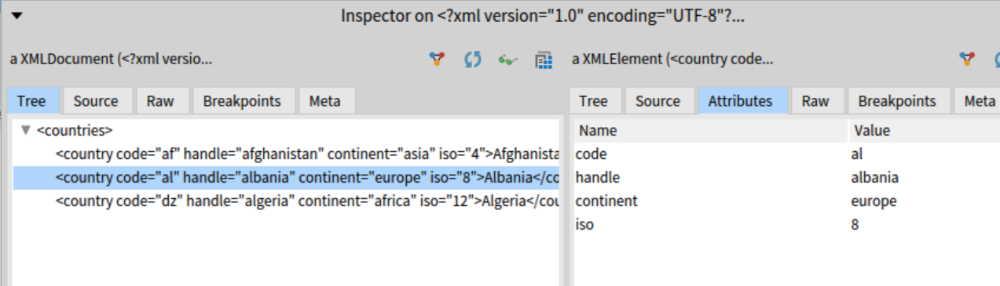

# XML-XMLParser

[](https://travis-ci.org/pharo-contributions/XML-XMLParser) [](https://coveralls.io/github/pharo-contributions/XML-XMLParser?branch=master)

XML Parser for [Pharo](http://www.pharo.org)

## Description

XMLParser provides validating SAX and DOM parsers for well-formed XML documents. It also provides a DOM API for manipulating documents, namespace support, and an optional XMLWriter for writing documents. Validation and namespace checking are enabled by default, but not resolution of external entities.

Implements:

http://www.w3.org/TR/REC-xml/

http://www.w3.org/TR/REC-xml-names/

http://www.w3.org/TR/xml-id/

http://www.w3.org/TR/xmlbase/

## Installation

```Smalltalk
Metacello new
	baseline: 'XMLParser';
	repository: 'github://pharo-contributions/XML-XMLParser/src';
	load.
```	

## How to use

Use the XMLDOMParser to parse a URL:
```Smalltalk
(XMLDOMParser parseURL: 'https://www.w3schools.com/xml/simple.xml') inspect
```

or give an XML file directly:
```Smalltalk
|xmlString|
xmlString := '<?xml version='1.0' encoding='UTF-8'?>
<countries>
  <country code='af' handle='afghanistan' continent='asia' iso='4'>Afghanistan</country>
  <country code='al' handle='albania' continent='europe' iso='8'>Albania</country>
  <country code='dz' handle='algeria' continent='africa' iso='12'>Algeria</country>
</countries>'.

(XMLDOMParser parse: xmlString) document  
```

Check (https://montyos.wordpress.com)[https://montyos.wordpress.com/] for more examples and descriptions.

## Screenshot



## LICENSE
[MIT License](LICENSE)
